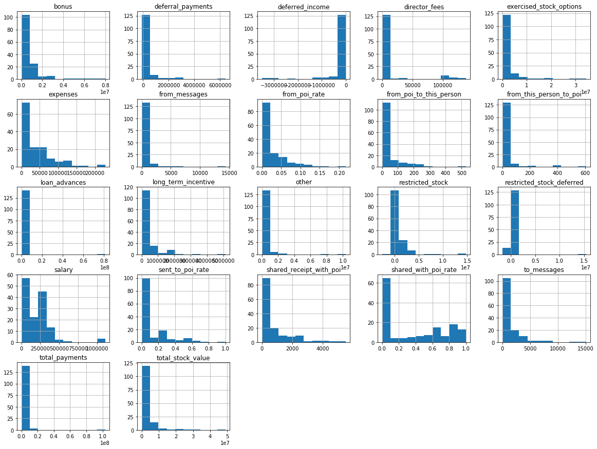
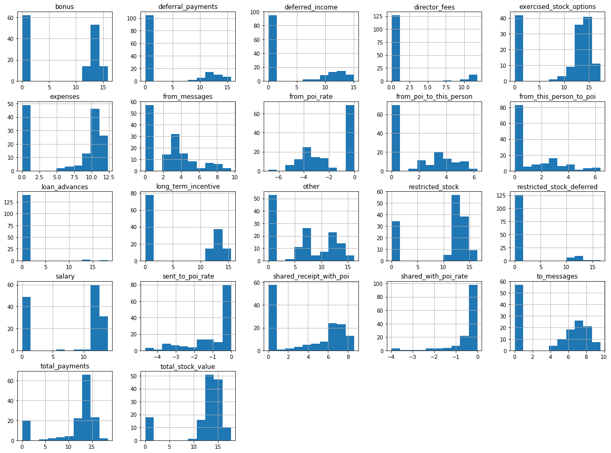

# 机器学习之安然数据集

*by F*

*2017/07/20*

## 概要

### 项目背景

项目研究的是历史上著名的安然事件，也称安然丑闻（[Enronl scandal](https://en.wikipedia.org/wiki/Enron_scandal)）。安然曾是 2000 年美国最大的公司之一。2002 年，由于其存在大量的企业欺诈行为，这个昔日的大集团土崩瓦解。在随后联邦进行的调查过程中，大量有代表性的保密信息进入了公众的视线，包括成千上万涉及高管的邮件和详细的财务数据。

项目目标：

- 训练一个机器学习算法来从安然公司员工的电子邮件和财务数据中，找出安然欺诈事件中的嫌疑人（后续简称 POI）。
 
数据来源：

- 原始数据：https://www.cs.cmu.edu/~./enron/ 
- 邮件数据：https://github.com/udacity/ud120-projects/tree/master/final_project/emails_by_address
- 财务数据：http://news.findlaw.com/hdocs/docs/enron/enron61702insiderpay.pdf

邮件数据和财务数据均由 Uda 的导师 Katie 整理出，最终在整合了成了 `final_project_dataset.pkl` 。

### 环境

```
python 3.6.1

> conda list
numpy                     1.12.1                   py36_0
pandas                    0.20.1              np112py36_0  
scikit-learn              0.18.1              np112py36_1  
```


### 文件说明

| File Path| Describe |
|----------|----------|
|README.md|工作文档，包含项目需要的问题回答|
|code/final_project_dataset|本项目所使用的数据集，包含安然员工的电子邮件信息和财务信息|
|code/poi_id.py|项目主要代码|
|code/tester.py|项目评估代码|
|code/feature_format.pkl|数据格式代码|
|code/my_dataset.pkl|运行 `poi_id.py` 后生成的数据集文件，包含处理过的数据集|
|code/my_classifier.pkl|运行 `poi_id.py` 后生成的模型文件，包含所挑选出的最佳模型|
|code/my_feature_list.pkl|运行 `poi_id.py` 后生成的特征文件，包含特征列表|


## 数据集探索


> 向我们总结此项目的目标以及机器学习对于实现此目标有何帮助。作为答案的部分，提供一些数据集背景信息以及这些信息如何用于回答项目问题。你在获得数据时它们是否包含任何异常值，你是如何进行处理的？


### 机器学习如何实现目标

这个项目的目标是，通过安然公司员工的财务和或电子邮件数据，用机器学习来预测某位安然员工是否参与到了欺诈事件中，即是否为 POI。

机器学习可以帮助我们发现多个特征和标签（是否为 POI）之间的联系。而这个过程需要通过安然数据集来训练。

### 数据集背景信息

未经处理的原始数据集基本信息：

```
==============
Original Dataset Info:

Index(['poi', 'bonus', 'deferral_payments', 'deferred_income', 'director_fees',
       'email_address', 'exercised_stock_options', 'expenses', 'from_messages',
       'from_poi_to_this_person', 'from_this_person_to_poi', 'loan_advances',
       'long_term_incentive', 'other', 'restricted_stock',
       'restricted_stock_deferred', 'salary', 'shared_receipt_with_poi',
       'to_messages', 'total_payments', 'total_stock_value'],
      dtype='object')
Number of persons: 146
Number of features: 21
Number of data points: 3066
Number of POIs: 18
Number of non-POIs: 128

```

- 数据集总共有 146 位员工信息，每位员工有 21 个特征
- 总共有 3066 个数据点
- 146 位员工中，有 POI 18 人，非 POI 128 人


### 异常值

分别对每位员工和特征进行 NaN 值统计

```

==============
Top 10 features NaN:

loan_advances                142
director_fees                129
restricted_stock_deferred    128
deferral_payments            107
deferred_income               97
long_term_incentive           80
bonus                         64
shared_receipt_with_poi       60
from_poi_to_this_person       60
from_messages                 60
dtype: int64

Top 10 person NaN:

LOCKHART EUGENE E                20
GRAMM WENDY L                    18
WROBEL BRUCE                     18
WHALEY DAVID A                   18
THE TRAVEL AGENCY IN THE PARK    18
WAKEHAM JOHN                     17
WODRASKA JOHN                    17
CLINE KENNETH W                  17
GILLIS JOHN                      17
SCRIMSHAW MATTHEW                17
dtype: int64

```

经过统计，发现存在比较多的缺失值:

- 其中缺失最为严重的特征是： `loan_advances` ，有 142 个缺失值，但不对有缺失值的特征进行处理，因为有可能恰恰是寻找 POI 的有利特征。
- 存在缺失值最多的员工是：`LOCKHART EUGENE E`，一共 21 个特征，缺失了 20 个，所以将其从数据集中删除
- 剩余的缺失值全部替换为 0

接下来观察数据集中除了缺失值外的异常值：

- `TOTAL` 这一项是错误的数据录入，其包含了数据集中所有财务信息的总和，将其删除
-  `THE TRAVEL AGENCY IN THE PARK` 不是人名，存在比较多的缺失值，应该也是错误的财务数据，将其删除


### 清理过的数据集

```
==============
Processed Dataset Info:
 Index(['poi', 'bonus', 'deferral_payments', 'deferred_income', 'director_fees',
       'email_address', 'exercised_stock_options', 'expenses', 'from_messages',
       'from_poi_to_this_person', 'from_this_person_to_poi', 'loan_advances',
       'long_term_incentive', 'other', 'restricted_stock',
       'restricted_stock_deferred', 'salary', 'shared_receipt_with_poi',
       'to_messages', 'total_payments', 'total_stock_value'],
      dtype='object')
Number of persons: 143
Number of features: 21
Number of data points: 3003
Number of POIs: 18
Number of non-POIs: 125


```

经过清理，安然数据集剩余 3003 个数据点，143 个员工数据，其中 POI 18 位，非 POI 125 位。

接下来我们将基于这个清理过的安然数据集进行特征处理。

## 特征工程

> 你最终在你的 POI 标识符中使用了什么特征，你使用了什么筛选过程来挑选它们？你是否需要进行任何缩放？为什么？作为任务的一部分，你应该尝试设计自己的特征，而非使用数据集中现成的——解释你尝试创建的特征及其基本原理。


现在数据集中总共有 21 个特征，可以分成 3 个类别的信息：

```
[label]
1. poi : 是否是嫌疑人 (True=POI, Flase=Non-POI)

[邮件相关]
2. email_address
3. to_messages            : 发送的电子邮件数量
4. from_messages          : 收到的电子邮件数量
5. from_poi_to_this_person: 收到的来自 POI 的邮件数量
6. from_this_person_to_poi: 发送给 POI 的邮件数量
7. shared_receipt_with_poi: 收到的来自 POI 的抄送邮件

[财务相关]
8. salary                    : 工资
9. bonus                     : 奖金
10. long_term_incentive      : 长期激励薪酬
11. deferred_income          : 延递收入
12. deferral_payments        : 延期薪酬
13. loan_advances            : 预支贷款
14. other
15. expenses                 : 开支
16. director_fees            : 董事费
17. total_payments           : 总薪酬和奖金
18. exercised_stock_options  : 已行使过的股票期权
19. restricted_stock         : 受限股票
20. restricted_stock_deferred: 延期的受限股票
21. total_stock_value        : 总股票价值
```

### 去除特征

- email_address：属于无关内容，对判断某个员工是否 POI 没有帮助，手动删除

### 创建新特征

按照经验可以知道，和 POI 的邮件往来频率应该是一个比较重要的特征，越频繁就说明越有可能对欺诈行为知情，甚至参与其中。原始特征只提供了收到和发送的数量，没有相关统计，于是创建三个新特征来表示与 POI 有关的往来邮件比率：

- from_poi_rate = 收到的来自 POI 邮件数 / 收到邮件数
- sent_to_poi_rate = 发送给 POI 的邮件数 / 发出的邮件数
- shared_with_poi_rate = 来自 POI 分享的邮件数 / 收到邮件数

### 特征选择

使用`SelectKBest`计算特征的得分，并排序：

```
==============
Features KBest Score:
                              score
exercised_stock_options    24.815080
total_stock_value          24.182899
bonus                      20.792252
salary                     18.289684
sent_to_poi_rate           16.409713
deferred_income            11.458477
long_term_incentive         9.922186
restricted_stock            9.212811
shared_with_poi_rate        9.101269
total_payments              8.772778
shared_receipt_with_poi     8.589421
loan_advances               7.184056
expenses                    6.094173
from_poi_to_this_person     5.243450
other                       4.187478
from_poi_rate               3.128092
from_this_person_to_poi     2.382612
director_fees               2.126328
to_messages                 1.646341
deferral_payments           0.224611
from_messages               0.169701
restricted_stock_deferred   0.065500
```

分数最高的是 `exercised_stock_options`,分数最低的是 `restricted_stock_deferred`，新建的三个特征分数分别是：

- sent_to_poi_rate           16.409713
- shared_with_poi_rate        9.101269
- from_poi_rate               3.128092

可以看到新建的特征表现出了一定的关联度。所以将他们保留，投入到算法模型中进行训练。


### 特征缩放

通过分别绘制特征的直方图，发现特征普遍存在着严重的偏斜:




于是将除了`poi`外的特征全部进行 log 转换：




可以看到，经过 log 变换后，特征的分布都更接近正态分布.

这样做的好处是：

- 一些算法是基于假设特征分布为正态分布的。如果特征接近正态分布，相对应的算法的性能也会更好
- 可以减少训练时间
- 进行 log 转换后的数据是可以经过指数变换复原的，并不会丢失数据信息


其余的特征缩放，将会在接下来的算法部分，根据算法的需求来进行。

## 算法选择和参数调整

> 你最终使用了什么算法？你还尝试了其他什么算法？不同算法之间的模型性能有何差异？

> 调整算法的参数是什么意思，如果你不这样做会发生什么？你是如何调整特定算法的参数的？（一些算法没有需要调整的参数 – 如果你选择的算法是这种情况，指明并简要解释对于你最终未选择的模型或需要参数调整的不同模型，例如决策树分类器，你会怎么做）。

### 算法

我选择了 6 种经典的分类算法来进行训练和测试，其中：

- 在 SVC 中，使用 MinMaxScaler 进行了特征缩放
- 由于数据集中的 POI 和非 POI 的分布非常不均衡，所以设置 class_weight = balanced 来达到样本均衡

通过`GridSearchCV`以`F1`分数为标准，为每种算法选出最佳模型，再经过`tester.py`中的`test_classifier`函数计算。整理出分数：


| Model| Accuracy |Precision|Recall|F1|F2|
|------|----------|---------|------|---|---|
|GaussianNB|0.62767|0.24927|0.89100|0.38955|0.58816|
|LogisticRegression|0.83500|0.41423|0.57350|0.48102|0.53255|
|SVC|0.85013|0.44710|0.52400|0.48250|0.50657|
|DecisionTreeClassifier|0.78427|0.30167|0.47000|0.36747|0.42281|
|RandomForestClassifier|0.86167|0.47095|0.30400|0.36949|0.32720|
|AdaBoostClassifier|0.82420|0.32296|0.29050|0.30587|0.29646|


继续以`F1`分数为标准，最终我选择了`SVC`算法下训练出的模型。

```

==============
The Best Model is:

Pipeline(steps=[('minmaxscaler', MinMaxScaler(copy=True, feature_range=(0, 1))), ('svc', SVC(C=100, cache_size=200, class_weight='balanced', coef0=0.0,
  decision_function_shape=None, degree=3, gamma=0.1, kernel='rbf',
  max_iter=-1, probability=False, random_state=42, shrinking=True,
  tol=0.001, verbose=False))])

 Accuracy: 0.85013
Precision: 0.44710
   Recall: 0.52400
       F1: 0.48250
       F2: 0.50657
Total predictions: 15000
   True positives: 1048
  False positives: 1296
  False negatives:  952
   True negatives: 11704

```


### 参数

大多数机器学习算法需要在学习之前设置参数。通常没有客观的方式设置这些参数，但它们影响算法的性能。参数调整是找到给定训练集的最优参数集合的过程，希望这将对测试数据产生更好的预测结果。最佳参数取决于应用机器学习算法的数据，通常是通过交叉验证来找到它们。最佳参数意味着给定机器学习算法，模型的预测能力最大化。

对于我的最终模型`SVC`，主要参数设置如下

```
{  # SVC pipeline
        'svc__kernel' : ('linear', 'rbf', 'poly', 'sigmoid'),
        'svc__C' : [0.1, 1.0, 10, 100, 1000, 10000],
        'svc__gamma' : [0.001, 0.01, 0.1, 1.0, 10, 100, 1000, 10000]
    },

```

根据参数的默认值和一些试验手动选择了参数范围。

## 评估和验证

> 什么是验证，未正确执行情况下的典型错误是什么？你是如何验证你的分析的？

> 给出至少 2 个评估度量并说明每个的平均性能。解释对用简单的语言表明算法性能的度量的解读。

### 验证

在机器学习中，将数据集按一定比例分成训练集和测试集，分别进行训练和测试，以防止过度拟合。

我在`GridSearchCV`中将进行了`cv=5`的设置，即以`StratifiedKFold`的验证方式，进行了 5 次单独的训练并验证。

### 评估

我选择了以下几个评估指标作为主要标准：

|Cursor|Describe|
|-----|---|
|Precision|被预测为 POI 的数量中，真的是 POI 的比例，即 `TP/(TP + FP)`|
|Recall|真的 POI 被正确预测出的比例，即 `TP/(TP + FN)`|
|F1|`2*(P*R)/(P+R)`|


- Precision：指认 POI 时应该非常确定
- Recall：不希望遗漏任何 POI

最后我选择了`F1`分数被作为首要的评估指标，原因是：在这个数据集中，样本分布非常不均，POI 和非 POI 的数量的差距非常大，如果仅仅使用`Precision`精确度或`Recall`召回率作为指标的话，容易出现过度关注其中某一个指标而忽视另一个的问题。`F1`分数可以很好地均衡这两个指标。`F1`越高，越意味着如果我的模型发现了 POI，那么此人几乎可以肯定是 POI，而且如果没有标记某人，那么几乎可以肯定他们不是 POI。


## Reference

- Enron Scandal：https://en.wikipedia.org/wiki/Enron_scandal
- Evaluating estimator performance：http://scikit-learn.org/stable/modules/cross_validation.html#cross-validation
- GridSearchCV：http://scikit-learn.org/stable/modules/generated/sklearn.model_selection.GridSearchCV.html#sklearn.model_selection.GridSearchCV.score
- 精确率、召回率、F1 值、ROC、AUC 各自的优缺点是什么？https://www.zhihu.com/question/30643044/answer/48955833
- https://github.com/watanabe8760/uda-da-p5-enron-fraud-detection
- https://github.com/mspbannister/dand-p5-enron

